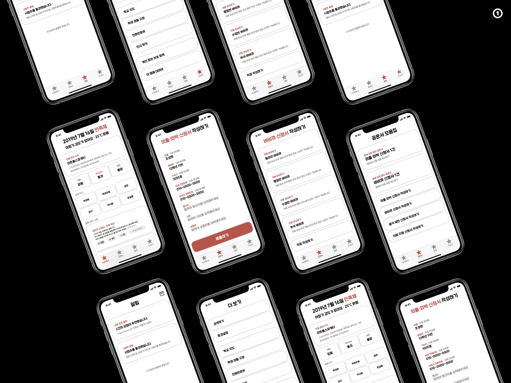
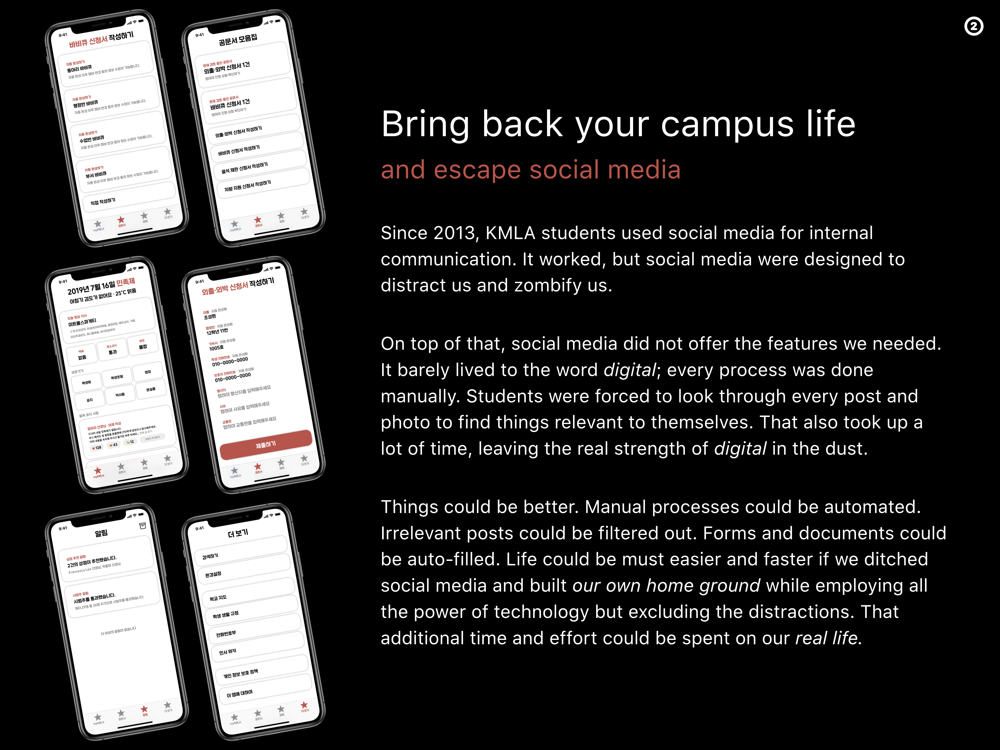
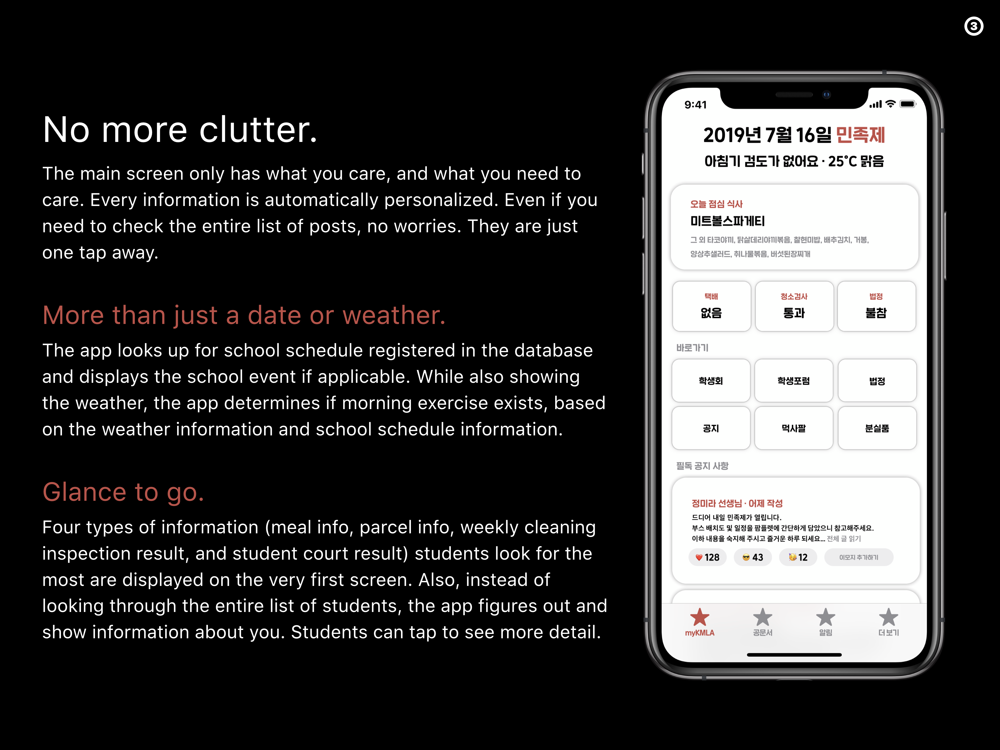
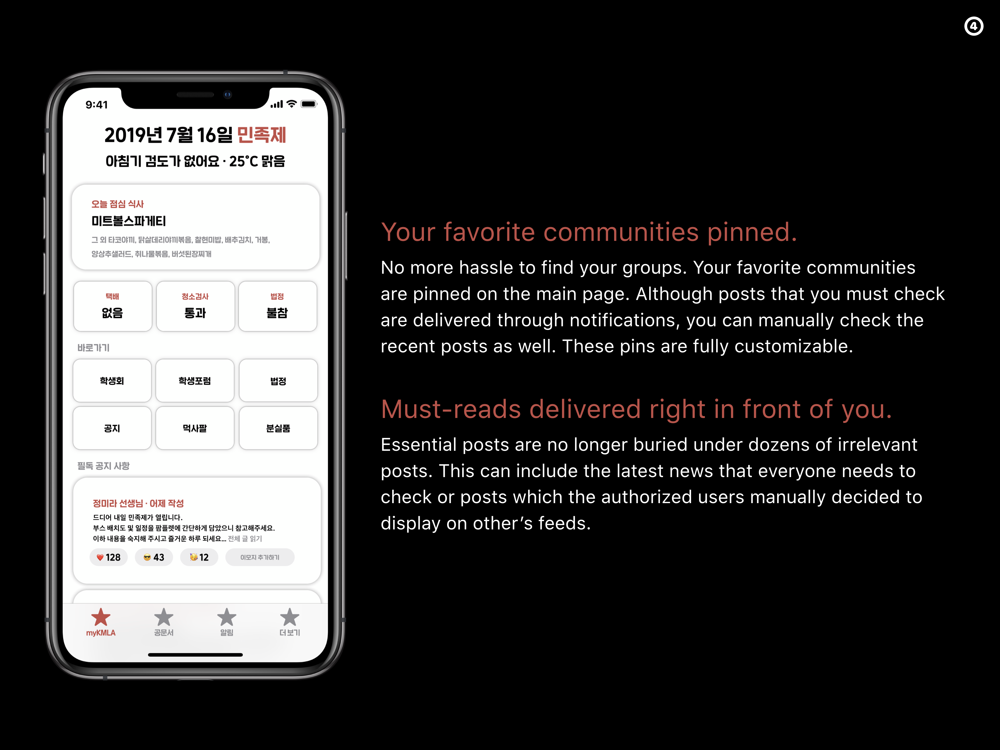
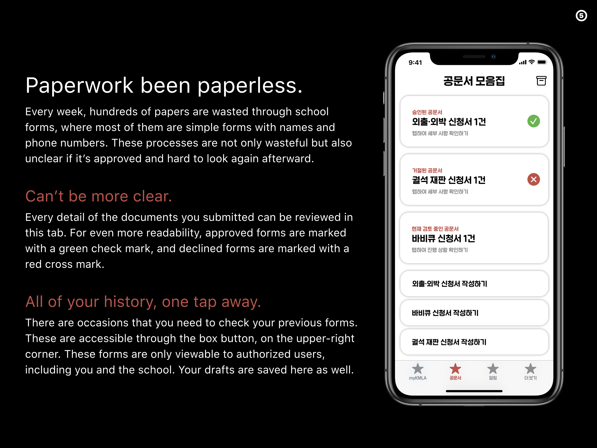
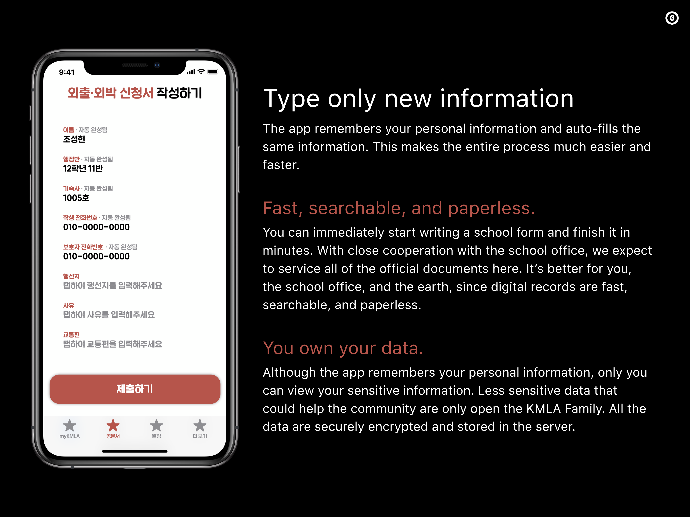
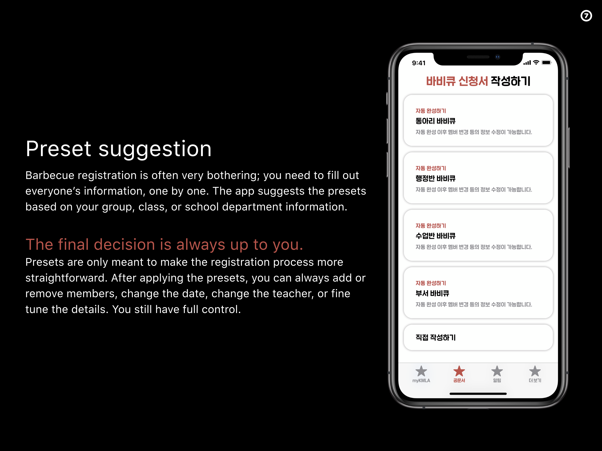
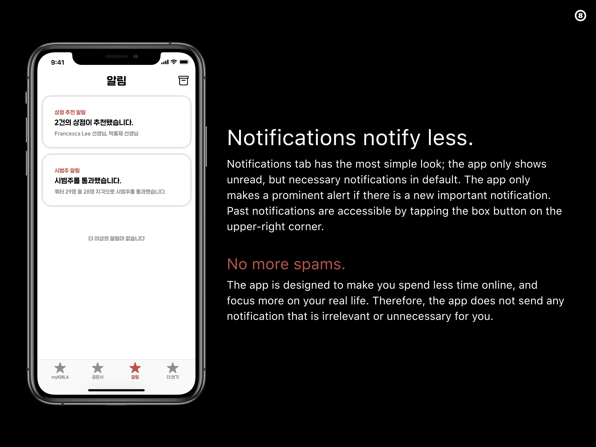
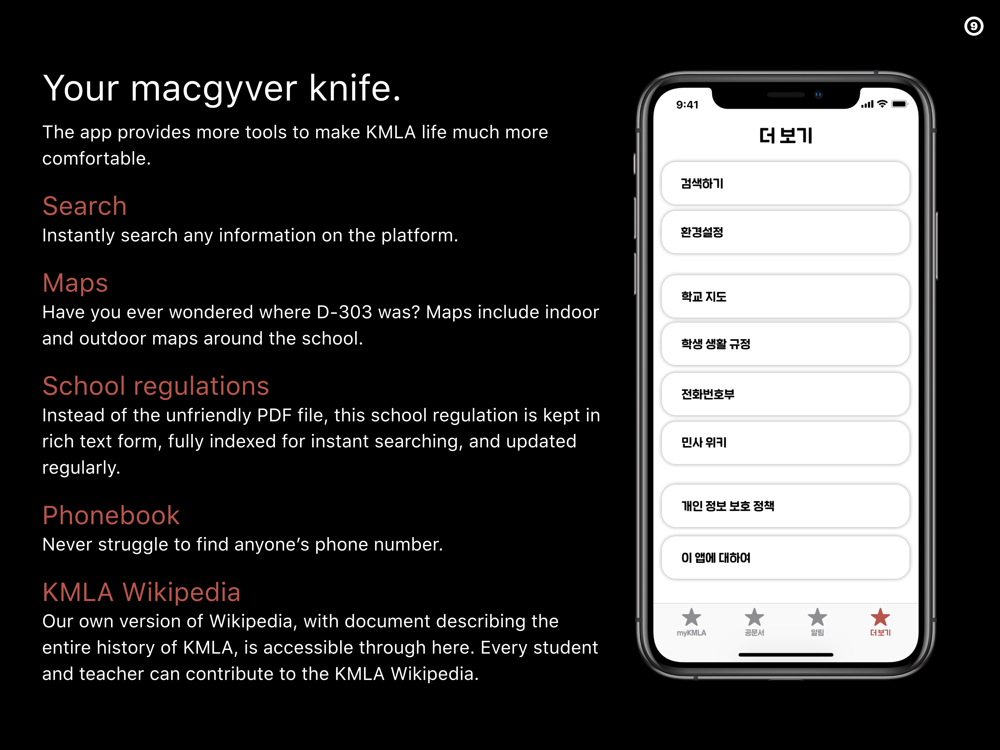

# myKMLA App Design

This app design is my AP Studio Art final project.

)

## Artist Statement

Since 2013, KMLA students used Facebook Groups for communications from simple conversations to important announcements. Although Facebook made communications convenient in the KMLA family, that came with a cost. Students slowly became addicted to social media. Virtually half of KMLA life was done through Facebook activities, posts, likes, or messages. Distracting us from our real life, Facebook slowly zombified KMLA students.

I designed the app while keeping the thought “how can we ‘prison-break’ Facebook, and make students spend less time online?” in mind. This could only be done by intentional interface design with a strong technical foundation. Simple design with dark red accent color was utilized to make essential things to pop out. Harmonizing with technologies, the app could intelligently show information you need and discourage you from spending more time online. It also can provide a faster, more convenient method to write and submit school documents by incorporating automating technologies. The entire user interface was designed to amplify these effects while keeping the intention to improve our students’ lives.

Ultimately, this artwork prototypes the idea “With a good design, we can escape the notoriously addictive social media.” In a world with technology ever growing and happiness level ever sinking, I experimented how far can design push people to take the advantages while eliminating the side effects of technology, therefore envisioning how social media technology should have been in the very first place.

## Demo

